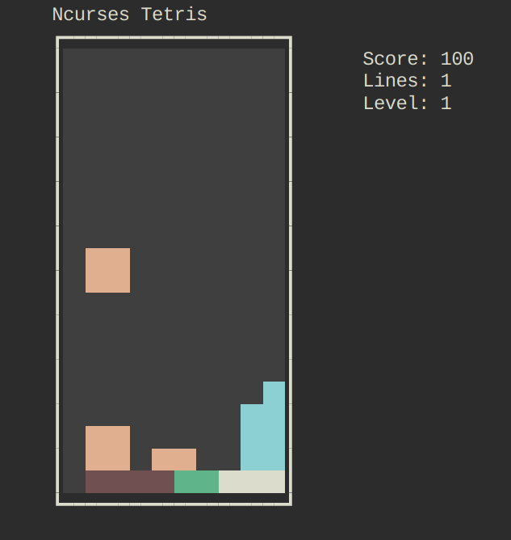

# ncurses-tetris
A simple Tetris clone written in C using [ncurses](https://invisible-island.net/ncurses/)

## Screenshots


## Features
- Classic Tetris gameplay
- Soft drop, hard drop, and rotation
- Ghost piece preview
- Scoring system based on line clears
- Level progression with increasing speed
- Pause and resume
- Colored tetrominoes (if terminal supports it)

## Build & Run
### Prerequisites
- GCC or another C compiler
- ncurses library

On Debian/Ubuntu, install ncurses with:
```bash
sudo apt install libncurses5-dev libncursesw5-dev
```

On Fedora:
```bash
sudo dnf install ncurses-devel
```

### Compilation
```bash
mkdir build
cd build
cmake ..
cmake --build .
```

## Controls
| Key       | Action         |
|-----------|----------------|
| ← / →     | Move left/right|
| ↓         | Soft drop      |
| ↑         | Rotate         |
| SPACE     | Hard drop      |
| p         | Pause/Resume   |
| q         | Quit           |

## Scoring
| Lines Cleared | Points (× Level) |
|---------------|------------------|
| 1             | 100              |
| 2             | 300              |
| 3             | 500              |
| 4             | 800              |

Level increases every 10 lines cleared, reducing drop interval.

## License
This project is licensed under the MIT License – see the [LICENSE](LICENSE) file for details.

